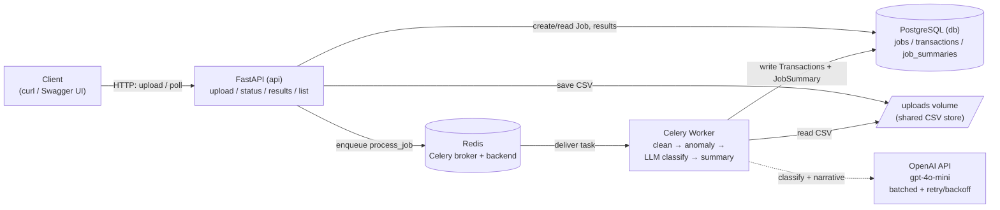

# Architecture

An editable diagram is in [`architecture.drawio`](architecture.drawio) — open it at
<https://app.diagrams.net> and use **File → Publish** for a public link. The same
architecture renders inline below (GitHub renders Mermaid).

## Request lifecycle

1. **Upload** — `POST /jobs/upload`: the API validates the CSV, creates a `Job`
   (`status=pending`) in Postgres, writes the file to the shared `uploads`
   volume, and enqueues `process_job(job_id)` on Redis. Returns `job_id` (202).
2. **Process** — the Celery worker consumes the task, sets `processing`, reads
   the CSV, then runs: **clean → detect anomalies → persist Transactions →
   LLM-classify uncategorised rows → build JobSummary**, and sets `completed`
   (or `failed` on an unexpected error).
3. **Poll** — `GET /jobs/{id}/status` and `/results` read straight from Postgres.

## Why these choices

- **FastAPI** — async I/O, typed request/response models, free OpenAPI docs.
- **Celery + Redis** — offloads the slow LLM work off the request path; first
  class retry/backoff for the LLM stages (§5e).
- **PostgreSQL + SQLAlchemy + Alembic** — relational data (Job → Transactions →
  Summary) with versioned, reproducible schema migrations.
- **Deterministic stats + LLM narrative** — sums/top-merchants/anomaly counts are
  computed in code (LLMs are unreliable at arithmetic); the LLM only writes the
  narrative and risk level.
